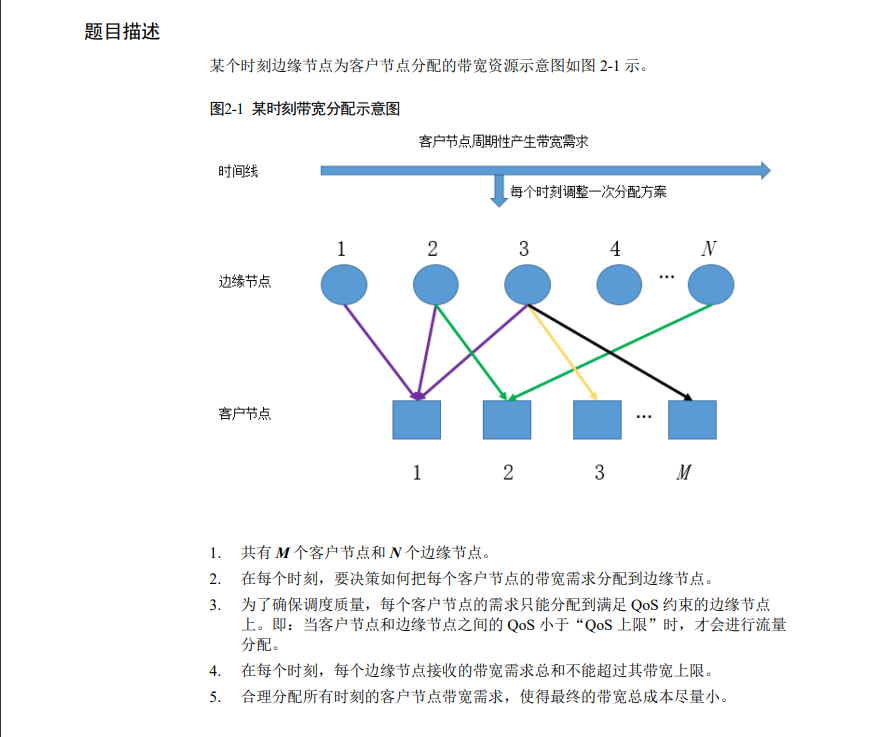
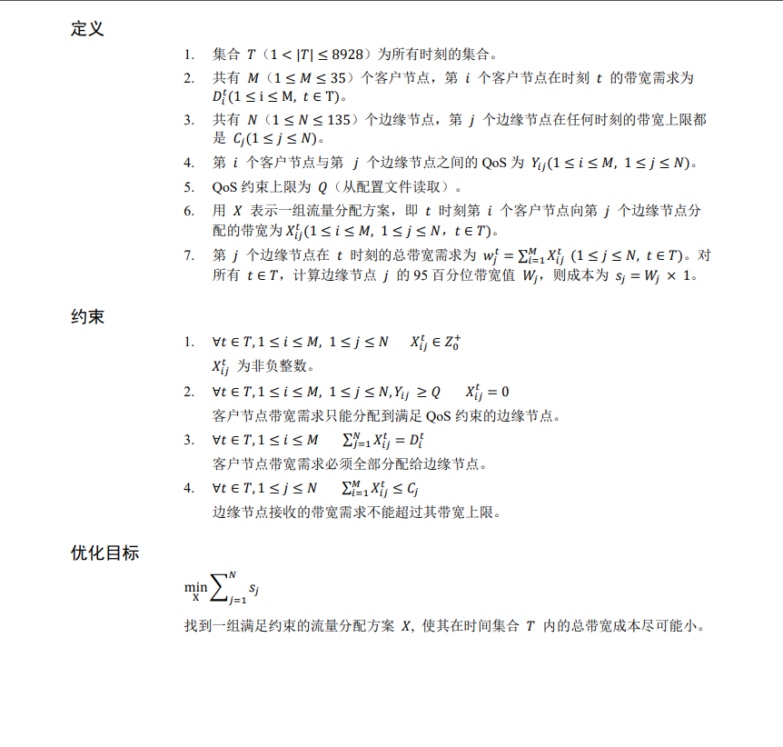

**2022华为软件精英挑战赛**

赛题如下：  
   
 
简要概括就是 官方提供客户端在不同时刻的流量需求，服务器的带宽，客户端与服务器之间的时延信息这三种信息，参赛者需指设计相应的策略，将客户端的流量分发给服务器。   
注意事项如下：  
1.每个时刻，都需要将客户端的流量需求全都分配到相应的服务器上  
2.客户端和服务器之间的时延有一个上限，只要小于这个上限的双方才能分配流量  
3.在每个时刻，服务器接收的流量分配不能超过其带宽  
4.指定相应的策略，使得最终的带宽总成本尽可能小

以下是赛题的数学描述：  

赛题最终的优化目标是每个服务器在时间序列排序后的95%位置的带宽值

我们组的思路是两轮分配：
1、第一轮先分配带宽给高负载的服务器。计算每个时刻
第二轮采用加权分配的思路。   
  赛题的优化目标是每台服务器在95%位置时刻的带宽，解释一下，即将服务器在所有时刻的带宽从小到大排个序，取第95%位置的值。这意味着每台服务器有（时刻*0.05）个时刻可以处于高负载的状态。在高负载状态下，让服务器接收越多带宽越好。
当服务器不处于高负载状态时，我们希望它被分配到的带宽要尽量均匀。容量越大，连接数越小，负载率低的服务器应当被分配到更多的带宽，将各个因素分配权值，按照权值去分配流量。  
并且在第二轮分配时，采用分级分配的思想，即先将服务器的容量设一个阈值比如20%，在该阈值下是否能满足用户的带宽需求，如果不能满足，提高上限rate比如从20%提高到30%，知道满足用户的全部带宽需求。
